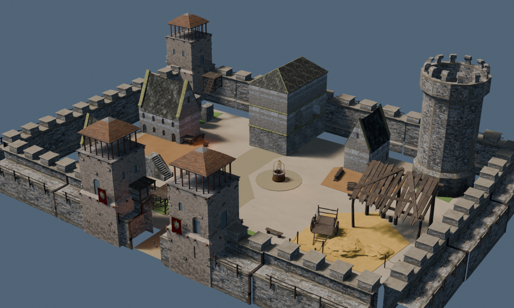

# Abnahmebericht - Fuerstenburg

## Ergebnis

- Kompakte mittelalterliche Burg mit geschlossener Ringmauer, vier Ecktuerme,
  offenem Suedtor, Innenhof, Donjon, Wirtschaftsgebaeuden, Stall und Brunnen
- Wassergraben, Bruecke, Insel, Ufersteine, Aussenboden und Anmarschweg entfernt
- Laufzeit-Root `BRG_CASTLE_RUNTIME_ROOT`
- 24 datengetriebene Kollisionsfuehrer und 3 Gameplay-Marker
- Runtime-Bounds etwa 61 x 46 x 16 Meter

## Phaser-3-Integration

- GLB und JSON unter `assets/houses/castle/`
- automatisches Laden auf der vorhandenen Area `burg`
- Darstellung ueber die bestehende Three.js-Canvas-Textur in Phaser
- Spieler-Spawn direkt am offenen Tor/Innenhof
- wasserfreie, freigeraeumte Stellflaeche ohne Aussenweg
- dynamische Teilung am Spielerfuss: Hof hinten, Suedmauer und Tor vorne
- Fluss-Naht nur als Randkollision, ohne Wasser-Shader auf der Burgkarte

## Verifikation

- Blender-Geometriepruefung: Tor ausgerichtet und dauerhaft offen, ungeeignete
  Torbogen- und Tuer-Module entfernt, Mauerring geschlossen, Hauptweg 4,4 m,
  keine schwebenden Teile oder kritischen Ueberschneidungen
- HTTP: Manifest und GLB werden vom Vite-Server mit Status 200 ausgeliefert
- Browser: `F10 > MAPS > Fuerstenburg` laedt die ueberarbeitete Burg sichtbar
  im echten Spiel, ohne schwarzen Bildschirm
- Browser-Konsole: nach dem Fix keine neuen Lade-, Shader- oder WebGL-Fehler
- TypeScript-Pruefung, 419 Vitest-Tests und Produktions-Build erfolgreich

## Vorschau

